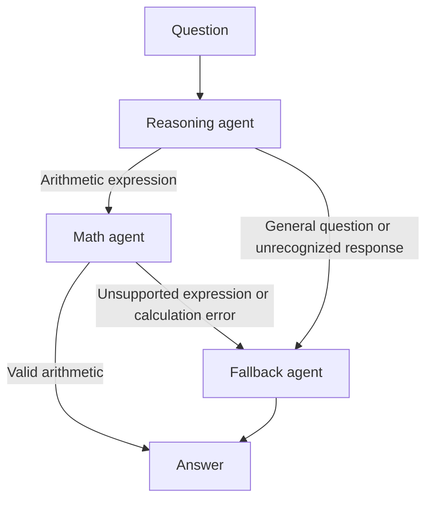

# Agentic Design Patterns: Tool-Using Assistant

A small LangGraph application that solves arithmetic questions with a restricted calculator and routes other questions to a general-answer fallback. The Streamlit interface keeps the conversation in a chat view and labels which path handled each answer.

## Workflow



The reasoning agent classifies each question and extracts a basic arithmetic expression when appropriate. The math agent evaluates only numeric literals and supported arithmetic operators; it does not execute arbitrary Python. If the question is general or the expression cannot be evaluated, the fallback agent answers the original question with the configured language model.

Supported calculator operators are `+`, `-`, `*`, `/`, `//`, `%`, `**`, parentheses, and unary `+` or `-`. Expressions are limited to 256 characters and exponents to a magnitude of 1,000.

## Requirements

- Python 3.11 or newer
- An OpenAI API key

## Setup

From the repository root, create and activate a virtual environment, then install the dependencies:

```powershell
py -3.11 -m venv .venv
.\.venv\Scripts\Activate.ps1
python -m pip install -r requirements.txt
Copy-Item .env.example .env
```

If PowerShell blocks the activation script, allow scripts for the current terminal process only, then activate the environment:

```powershell
Set-ExecutionPolicy -Scope Process -ExecutionPolicy Bypass
.\.venv\Scripts\Activate.ps1
```

Add your key to `.env`:

```dotenv
OPENAI_API_KEY=your_api_key_here
```

The `.env` file is ignored by Git. Do not commit API keys.

## Run the app

Start the Streamlit chat interface:

```powershell
streamlit run app.py
```

Or run the sample question from the command line:

```powershell
python -m patterns.tool_using.run
```

## Tests

Run the workflow and calculator tests without making an OpenAI request:

```powershell
python -m unittest discover -s tests -v
```

The tests stub the language model and cover arithmetic routing, general-question fallback, fallback after an unsupported expression, and rejection of arbitrary code by the calculator.

## Project layout

```text
app.py                          Streamlit chat interface
config/llm.py                   OpenAI chat model configuration
patterns/tool_using/graph.py    LangGraph routing and workflow
patterns/tool_using/nodes.py    Reasoning, math, and fallback nodes
patterns/tool_using/state.py    Shared workflow state
tools/calculator.py             Restricted arithmetic evaluator
tests/                          Offline workflow tests
```
