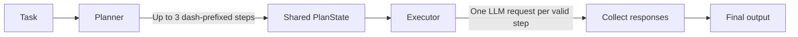

# Planner-Executor Pattern

This guide explains the `planner_executor` example in beginner-friendly terms. The pattern splits one task into two jobs:

1. A **planner** breaks a task into smaller steps.
2. An **executor** asks the language model to complete each step and combines the responses.

Think of it like writing a short checklist first, then working through each checklist item.

## The Workflow



The graph runs from start to finish once. It does not loop back to revise the plan.

## What Each File Does

| File | Responsibility |
| --- | --- |
| [`state.py`](state.py) | Defines the information passed through the graph: the original `task`, the `plan`, and the final `output`. |
| [`nodes.py`](nodes.py) | Implements the `planner` and `executor` functions. Both use the configured language model. |
| [`graph.py`](graph.py) | Connects the planner to the executor and compiles the LangGraph workflow. |
| [`run.py`](run.py) | Provides a sample task, invokes the graph, and prints the returned state as JSON. |
| [`../../config/llm.py`](../../config/llm.py) | Configures the `gpt-4o-mini` chat model and loads environment variables from `.env`. |

## Step-by-Step Walkthrough

### 1. A task enters the graph

[`run.py`](run.py) calls `run_task(task)`. That function builds the graph and invokes it with an initial state containing the task, for example:

```python
{"task": "Create a simple 3-step plan for launching an AI chatbot product."}
```

The `PlanState` type in [`state.py`](state.py) describes the fields used as the workflow runs:

- `task`: the original request
- `plan`: a list of steps produced by the planner
- `output`: the combined executor responses

### 2. The planner creates a checklist

The `planner` function sends the task and instructions to the language model. Its prompt asks for:

- At most three steps
- Each step to start with a dash (`-`)
- No extra explanations in the plan

It splits the model response at newline characters and returns the resulting list as `plan`. For example, a possible plan might look like:

```text
- Identify the target users
- Build the chatbot's core experience
- Test the product and prepare a launch
```

The exact wording depends on the model response; this is an illustration, not a fixed result.

### 3. LangGraph passes state to the executor

[`graph.py`](graph.py) creates a `StateGraph` using `PlanState`, adds the planner and executor as nodes, and connects them in order:

```text
START -> planner -> executor -> END
```

Each node returns only the fields it updates. LangGraph merges those updates into the shared state, so the executor receives both the original task and the planner's `plan`.

### 4. The executor works through the steps

The `executor` loops over the plan in order. For each item, it:

1. Removes leading and trailing whitespace.
2. Skips the item if it is blank or does not start with `-`.
3. Sends that one step to the language model with instructions to complete it clearly and concisely.
4. Adds the response to a results list.

At the end, it joins the responses with a blank line between them and returns that string as `output`.

### 5. The caller receives the result

`run_task` returns the final graph state. The sample in [`run.py`](run.py) prints the state as formatted JSON, including the task, plan, and output.

## Important Detail: What "Executor" Means Here

In this project, the executor is another language-model call. It does **not** run Python, execute shell commands, call external tools, or automatically carry out real-world actions. It writes a response for each plan step.

Also, each executor request contains the current step, but not the responses from earlier steps. The executor processes steps sequentially in a Python loop, yet later steps do not receive earlier generated results as context. This is suitable for independent steps, but it is not a fully stateful multi-step agent.

## How to Run It

From the repository root, activate the virtual environment and run the module:

```powershell
.\.venv\Scripts\Activate.ps1
python -m patterns.planner_executor.run
```

The project needs an OpenAI API key in the root `.env` file. Follow the environment setup in the [main README](../../README.md). The sample task is currently defined in [`run.py`](run.py).

## Current Limitations

- The plan is limited by the prompt to at most three steps, but the code does not independently enforce that limit.
- The executor skips lines that do not start with a dash; it does not ask the planner to repair an invalid plan.
- There is no retry, review, or re-planning loop if an executor response is incomplete.
- Steps are sent as separate model requests without the full task or earlier step responses in each executor prompt.
- A model/API error stops the run; the graph does not currently provide an error-recovery path.

## Where to Experiment

- Change the planner instructions in [`nodes.py`](nodes.py) to adjust how it breaks down a task.
- Change the executor prompt in [`nodes.py`](nodes.py) to control the style or detail of each step's response.
- If you need each step to use earlier results, add those results to `PlanState` and include them in the executor prompt.
- If you need plan checking or retries, add another node and conditional edges in [`graph.py`](graph.py).
